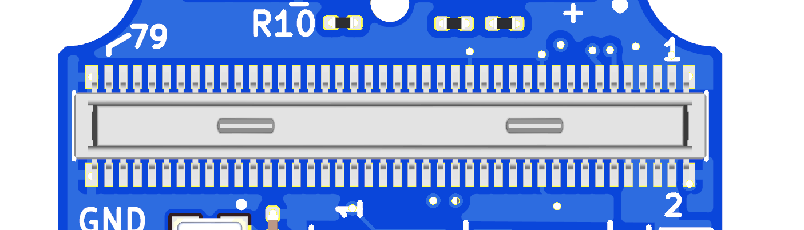
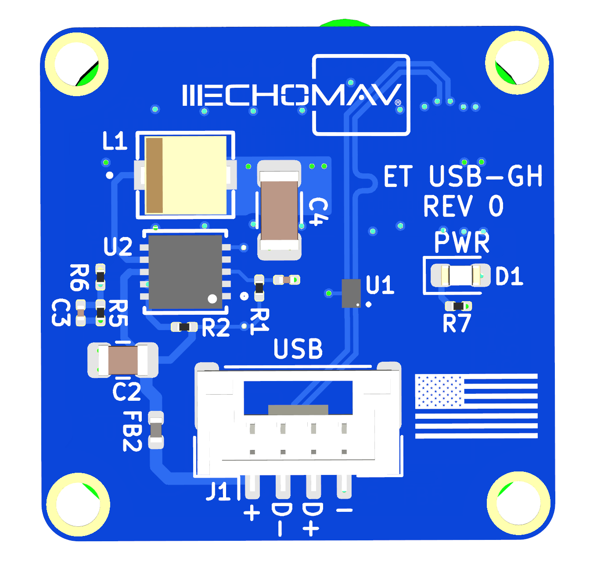

# Pinouts and Connectors

## Backplate Configuration

### No Backplate 
The EchoTherm can be used with no backplate attached, in which the user must create or use a commercial thermal module carrier board. The EchoTherm Module is form-factor and pin-compatible with FLIR Boson adapters as long as those adapter use the USB interface.  

The connector on the back of the EchoTherm is a Hirose DF40C-80DP-0.4V(51) and is designed to be used with the mating connector DF40HC(4.0)-80DS-0.4V(51).

| Pin Number | Direction | Voltage | Pin Description    |
|------------|-----------|---------|-------------------|
| 1          | Pwr         | GND    | GND |
| 2          | Pwr         | +3.3V     | Power In |
| 3          | Pwr       | GND     | GND              |
| 4          | Pwr         | +3.3V     | Power In |
| 5          | Pwr       | GND     | GND              |
| 6          | Pwr         | +3.3V     | Power In |               |
| 7          | Pwr       | GND     | GND              |
| 8          | Pwr         | +3.3V     | Power In |
| 9          |  IO         |   NA      | USB D-                 |
| 10          | Pwr       | GND     | GND              |  
| 11          |  IO         |   NA      | USB D+                 |
| 12         |  NA         |   NA      | NC                  |
| 13          | Pwr       | GND     | GND              |
| 14          |  NA         |   NA      | NC                  |
| 15          | NA          |   NA      | NC                  |
| 16          |  NA         |   NA      | NC                  |
| 17          | NA          |   NA      | NC                  |
| 18          |  NA         |   NA      | NC                  |
| 19          | Pwr       | GND     | GND              |
| 20          | Pwr       | GND     | GND              |
| 21          | NA          |   NA      | NC                  |
| 22         |  NA         |   NA      | NC                  |
| 23          | NA          |   NA      | NC                  |
| 24          |  NA         |   NA      | NC                  |
| 25          | NA          |   NA      | NC                  |
| 26          |  NA         |   NA      | NC                  |
| 27          | NA          |   NA      | NC                  |
| 28          |  NA         |   NA      | NC                  |
| 29          | Pwr       | GND     | GND              |
| 30          | Pwr       | GND     | GND              |
| 31          | NA          |   NA      | NC                  |
| 32         |  NA         |   NA      | NC                  |
| 33          | NA          |   NA      | NC                  |
| 34          |  NA         |   NA      | NC                  |
| 35          | NA          |   NA      | NC                  |
| 36          |  NA         |   NA      | NC                  |
| 37          | NA          |   NA      | NC                  |
| 38          |  NA         |   NA      | NC                  |
| 39          | Pwr       | GND     | GND              |
| 40          | Pwr       | GND     | GND              |
| 41          | NA          |   NA      | NC                  |
| 42         |  NA         |   NA      | NC                  |
| 43          | NA          |   NA      | NC                  |
| 44          |  NA         |   NA      | NC                  |
| 45          | NA          |   NA      | NC                  |
| 46          |  NA         |   NA      | NC                  |
| 47          | NA          |   NA      | NC                  |
| 48          |  NA         |   NA      | NC                  |
| 49          | Pwr       | GND     | GND              |
| 50          | Pwr       | GND     | GND              |
| 51          | NA          |   NA      | NC                  |
| 52         |  NA         |   NA      | NC                  |
| 53          | NA          |   NA      | NC                  |
| 54          |  NA         |   NA      | NC                  |
| 55          | NA          |   NA      | NC                  |
| 56          |  NA         |   NA      | NC                  |
| 57          | NA          |   NA      | NC                  |
| 58          |  NA         |   NA      | NC                  |
| 59          | Pwr       | GND     | GND              |
| 60          | Pwr       | GND     | GND              |
| 61          | NA          |   NA      | NC                  |
| 62         |  NA         |   NA      | NC                  |
| 63          | NA          |   NA      | NC                  |
| 64          |  NA         |   NA      | NC                  |
| 65          | NA          |   NA      | NC                  |
| 66          |  NA         |   NA      | NC                  |
| 67          | NA          |   NA      | NC                  |
| 68          |  NA         |   NA      | NC                  |
| 69          | Pwr       | GND     | GND              |
| 70          | Pwr       | GND     | GND              |
| 71          | NA          |   NA      | NC                  |
| 72         |  NA         |   NA      | NC                  |
| 73          | NA          |   NA      | NC                  |
| 74          |  NA         |   NA      | NC                  |
| 75          | NA          |   NA      | NC                  |
| 76          |  NA         |   NA      | NC                  |
| 77          | NA          |   NA      | NC                  |
| 78          |  NA         |   NA      | NC                  |
| 79          | Pwr       | GND     | GND              |
| 80          |  NA         |   NA      | NC                  |

### USB Backplate

The included USB 2.0 adapter board attaches to the Hirose connector above, and provides a JST GH 4 pin connector for USB connectivity. A USB Micro to JST GH adapter is included, but the pinout is provided below if you wish to make a custom cable assembly.

| Pin Number | Direction | Voltage | Pin Description    |
|------------|-----------|---------|-------------------|
| 1          | Pwr         | +5.0V    | Power In |
| 2          | IO        | NA     | USB D- |
| 3          | IO       | NA     | USB D+             |
| 4          | Pwr         | GND     | GND |

