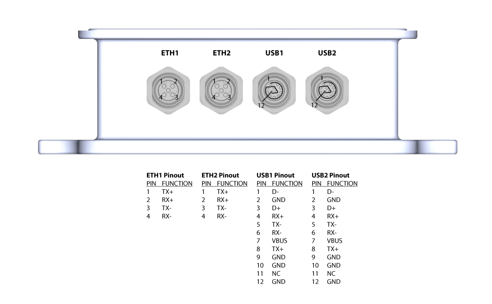
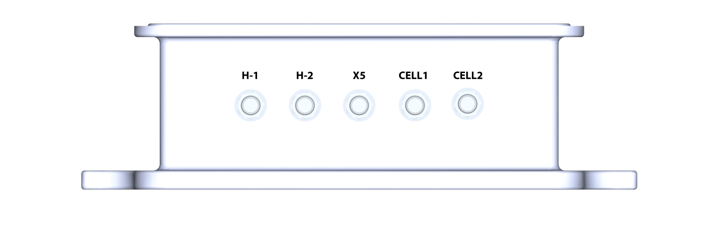

# Pinouts and Connectors

The PWR LED on the left side indicates that the system is powered and running. The STATUS LED is an RGB output indicating the status of the autopilot. Please refer to the autopilot firmware documentation for the meaning of the STATUS LED, e.g. [ArduRover RGB LED documentation](https://ardupilot.org/rover/docs/common-leds-pixhawk.html#rgb-leds). Both LEDs can be deactivated by changing the position of a DIP switch located inside the case. 

Connector   | Pins | Type | Part Number | Mating Cable Assembly | Notes
------------ | ------------- | ------------- | ------------- | ------------- | ------------- 
PWR       | 4 | M12, A-Code Male  | T4140012041-000  | Tensility 10-03805 |  13-36VDC, 4A + supply        
PWM       | 12 | M12, A-Code Female | T4141012121-000  | Custom |          
INS       | 8 | M12, A-Code Female | T4141012081-000  | Custom |  
IRIDIUM   | 12 | M12, A-Code Female    | T4141012121-000 | Custom | 
FMU CAN   | 4 | M12, A-Code Female  | T4141012041-000 | Custom | 
NMEA2K    | 5 | M12, A-Code Female   | T4141012051-000  | Custom |   
ANALOG IN | 5 | M12, D-Code Female   | T4141512051-000     | Custom |  

!!! note
    Serial Number 0001 hardware uses different USB pinout, please contact EchoMAV if using Serial Number 0001.

Connector   | Pins | Type | Part Number | Mating Cable Assembly | Notes
------------ | ------------- | ------------- | ------------- | ------------- | ------------- 
ETH       | 4 | M12, D-Code Female  |  T4141512041-000  | ASI-M12-RJ45-11101 |  100 Mbps Ethernet to Jetson      
ETH       | 4 | M12, D-Code Female | T4141512041-000 | ASI-M12-RJ45-11101 | 100 Mbps Ethernet to Jetson             
USB       | 12 | M12, A-Code Female | T4141012121-000  | Custom | USB 3 SS to Jetson    
USB       | 12 | M12, A-Code Female    | T4141012121-000 | Custom | USB 3 SS to Jetson

Connector   | Type | Part Number  | Notes
------------ | ------------- | ------------- | ------------- 
H-1       | SMA  | CABLE 385 RF-150-A-2   |  Mosaic H, Channel 1      
H-2    | SMA | CABLE 385 RF-150-A-2  |  Mosaic H, Channel 2 
X5       | SMA | CABLE 385 RF-150-A-2  |  Mosaic X5   
CELL1   | SMA    | CABLE 385 RF-150-A-2 | Cellular 1          
CELL2   | SMA | CABLE 385 RF-150-A-2 |  Cellular 2

