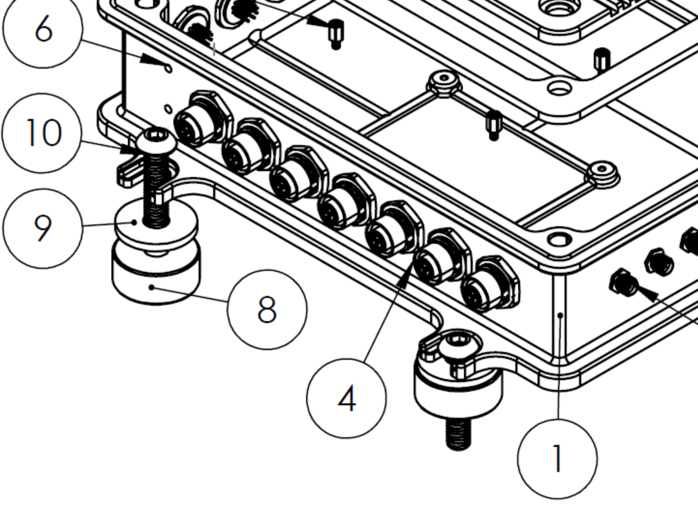

# Mechanical

## 2D Drawing

Download [2D Drawing Here](assets/2Ddrawing.pdf)

## STEP Files

Download [STEP File Here](assets/EchoTherm.STEP)

## Vibration Isolation

When used in high-g or high-vibration environments, we recommend the use of vibration-damping mounts, consisting of McMaster Carr parts [93849A202](https://www.mcmaster.com/catalog/130/3678/93849A202) (washer) and [60525K21](https://www.mcmaster.com/catalog/130/1691/60525K21) (vibration-damping mount). Please refer to the image below for installation.

