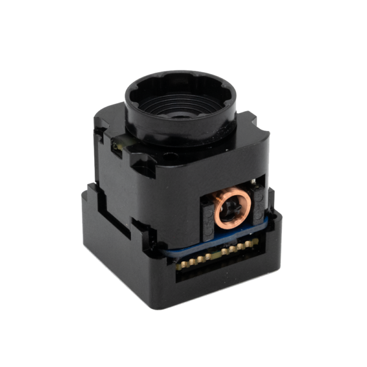

# EchoTherm Overview 

The EchoTherm Module is an easy-to-use, NDAA compliant thermal imager proudly made in the US. 

Designed for low-cost unmanned systems, the 320×240 pixel resolution and 4.0mm focal length provides standoff target detection from up to 330 meters away.  The integrated micro-shutter assembly provides automatic non-uniformity correction. The shutter, combined with onboard image processing, work together to generate extremely low-noise images and videos. EchoMAV’s open-source software suite makes it easy to acquire video and interact with the module (zoom, record, change color palettes and more.) Each module can be integrated tightly into custom hardware via an industry standard footprint/connector, or is compatible with a USB cable using the included adapter.

Get started now: [:material-run-fast: Quick Start Guide](quickstart.md)