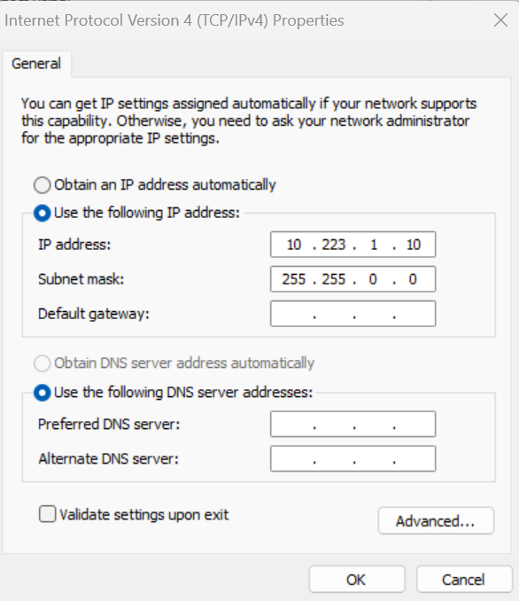

# Quick Start Guide

The goal of this quick start guide is to power the EchoTherm module and get a telemetry stream over the network to your host computer running either [QGroundControl](https://docs.qgroundcontrol.com/master/en/getting_started/download_and_install.html) or [Mission Planner](https://ardupilot.org/planner/docs/mission-planner-installation). This process will get you familiar with the hardware, but is only touching the surface of what you can do with this system. 

We will be streaming telemetry over the network, so the first step is to configure your host computer so that is is compatible with the default networking settings of the EchoTherm system. To do so, we will be setting your host IP address to __10.223.1.10/16__.
!!! info
    By default, the EchoTherm system streams telemetry to 10.223.1.10:14550 using UDP. The instructions below will walk you through setting your host computer to this IP address and installing a Ground Control Software package.

## Prerequisites

You will need a Ground Control Software (GCS) solution installed on your host computer. Either [QGroundControl](https://docs.qgroundcontrol.com/master/en/qgc-user-guide/getting_started/download_and_install.html) or [Mission Planner](https://ardupilot.org/planner/docs/mission-planner-installation.html) are recommended. Note that Mission Planner is only available for Windows, while QGroundControl is available for most hardware including Android, Linux, Windows, Mac, etc. Before proceeding, install one. If you don't have a preference, we prefer QGroundControl as it is more user friendly. Although be aware some advanced features or set up may require Mission Planner. 

## Quick Start Steps

First configure your host computer to have an IP of 10.223.1.10/16 using the instructions below for Windows/Linux.
!!! info
    **On Windows:** Open Device Manager (Windows Key + X → Press "W" → Click on "Change adapter options" → Right click, properties of the adapter connected to the EchoPilot AI → Highlight "Internet Protocol Version 4 (TCP/IPv4) and click __Properties__ ). Select "Use the following IP address" and configure the IP address and Subnet mask as shown below. Then click __OK__ → __Close__.  

    

    **On Linux:**

    Command line instructions are provided below. Modern flavors of Linux (e.g. Ubuntu) will provide a user interface to change the IP address, which you are free to use if you know how to do so.

    Using a terminal window, find the wired interface name, most typically this can be found using:
    ```
    $ ip ad
    enp43s0: <NO-CARRIER,BROADCAST,MULTICAST,UP> mtu 1500 qdisc fq_codel state DOWN group default qlen 1000
    link/ether 34:73:5a:e8:57:3f brd ff:ff:ff:ff:ff:ff

    ```
    In the response above, the interface name is `enp43s0`. Use `nmcli` and the interface name found above set the static IP address to 10.223.1.10/16: 
    ```
    $ nmcli con add con-name "static-eth" ifname enp43s0 type ethernet ip4 10.223.1.10/16
    $ nmcli con up "static-eth"
    ```
    Now take down the other connections, for example a connection `enp43s0` is shown below:
    ```
    $ nmcli con show
    NAME         UUID                 TYPE           DEVICE
    enp43s0      ff9804db5-........   802-3-ethernet --
    static-eth   a4b59cb4a-........   802-3-ethernet ens32

    $ nmcli con down enp43s0
    ```


1. Plug in an RJ45 to M12 cable assembly between the EchoTherm system and your host computer (use either ETH port).
2. Power on the EchoTherm system using a 13-36VDC power supply and M12 power cable assembly provided (ensure the power source can supply 4A). The green PWR LED should light up.
3. Open your GCS application on the host computer. If a firewall warning is provided, ensure you __accept__ the connection.
4. Once the EchoTherm system is booted (approximately 60s), telemetry will start to flow from the EchoTherm system to 10.223.1.10:14550 via UDP. If you correctly followed the steps above, you should automatically get a connection over the network.

